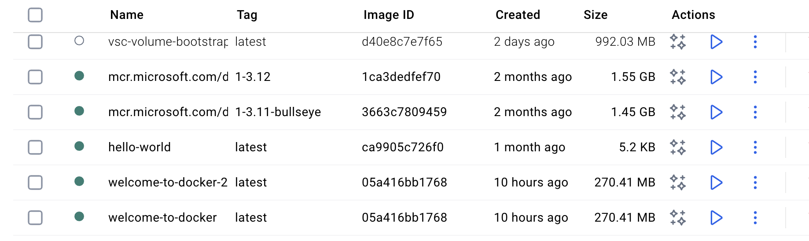

# Welcome to Docker 🚀

This project demonstrates how to containerize a simple Node.js application using Docker.

---

## Build and Run

### 1. Build the Docker image
```bash
docker build -t welcome-to-docker .
```

- `docker build` → builds a Docker image from the `Dockerfile` in the current directory (`.`).  
- `-t welcome-to-docker` → the `-t` flag stands for **tag**. It assigns a name (`welcome-to-docker`) to your image.  
  - The name can be **anything** you want (e.g., `myapp:v1`).  
- Once the build is complete, you will see the image listed in **Docker Desktop → Images tab**.  


---

### 2. Run the Docker container
```bash
docker run -d -p 8088:3000 --name welcome-to-docker welcome-to-docker
```

Breaking it down:

- `docker run` → runs a container from an image.  
- `-d` → detached mode (runs in the background).  
- `-p 8088:3000` → maps port `3000` inside the container to port `8088` on your local machine.  
  - That means the app running on `3000` inside the container is accessible at `http://localhost:8088`.  
- `--name welcome-to-docker` → gives your container a readable name (instead of a random ID).  
- The last `welcome-to-docker` → tells Docker which **image** to run (the one you built in step 1).  



---

### 3. Open the app
Once the container is running, open your browser and visit:

👉 [http://localhost:8088](screenshots/docker-desktop-containers.png)

You should see your application running.

---

## Stopping the container
When finished, stop the container either from Docker Desktop or with:

```bash
docker stop welcome-to-docker
```
